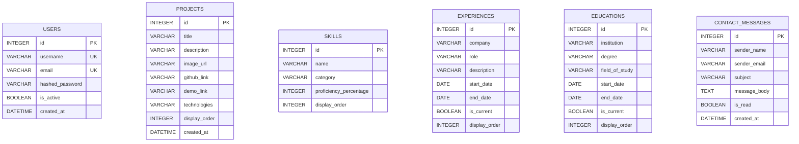
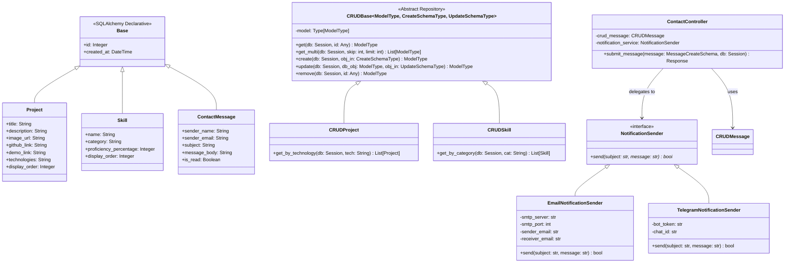
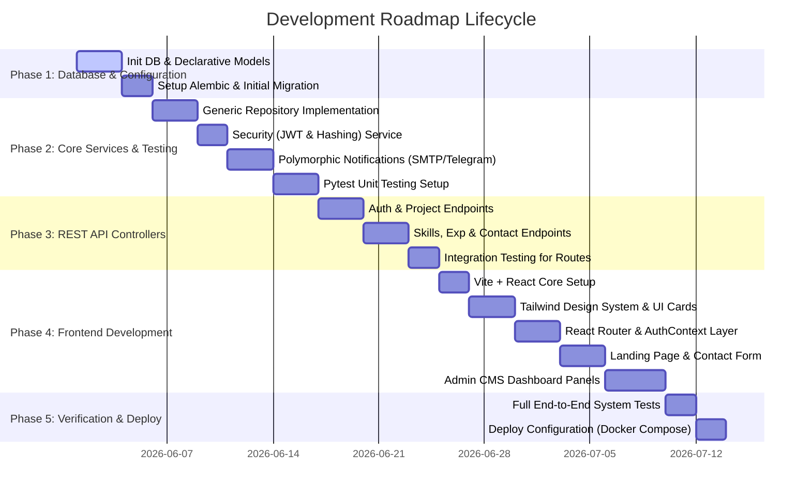

# Software Architecture Specification: Meenu-Dev Company Website

This document provides a production-ready, industry-standard software architecture specification for a modular, clean, and highly scalable company website for Meenu-Dev.

---

## 1. Modular Folder Structure

The project is divided into two primary workspaces: `backend` (Python FastAPI) and `frontend` (React + Tailwind CSS). It follows a layered, decoupled design patterns where business logic, data persistence, and presentation are strictly separated.

```text
portfolio-website/
├── backend/
│   ├── app/
│   │   ├── __init__.py
│   │   ├── main.py                 # FastAPI Application entry point
│   │   ├── config.py               # Settings and environment variables
│   │   ├── db/
│   │   │   ├── __init__.py
│   │   │   ├── session.py          # SQLAlchemy engine and sessionmaker
│   │   │   └── base_class.py       # Declarative base model class
│   │   ├── models/                 # SQLAlchemy ORM Database Models (OOP Inheritance)
│   │   │   ├── __init__.py
│   │   │   ├── auth.py             # User and Token models
│   │   │   ├── portfolio.py        # Project, Skill, Experience, Education models
│   │   │   └── contact.py          # Message / Contact models
│   │   ├── schemas/                # Pydantic validation schemas (Data Encapsulation)
│   │   │   ├── __init__.py
│   │   │   ├── auth.py
│   │   │   ├── portfolio.py
│   │   │   └── contact.py
│   │   ├── repository/             # Data Access Layer (Encapsulation & Polymorphism)
│   │   │   ├── __init__.py
│   │   │   ├── base.py             # Abstract / Generic Base CRUD Repository
│   │   │   ├── project.py          # Project-specific query operations
│   │   │   ├── skill.py            # Skill-specific query operations
│   │   │   ├── experience.py       # Experience-specific query operations
│   │   │   └── user.py             # User authentication database operations
│   │   ├── services/               # Business Logic Layer (Polymorphic notifications, logic encapsulation)
│   │   │   ├── __init__.py
│   │   │   ├── auth.py             # Password hashing, JWT generation
│   │   │   └── notification/       # Polymorphic contact message notifications
│   │   │       ├── base.py         # Abstract Notification Base class
│   │   │       ├── email.py        # SMTP Notification implementation
│   │   │       └── telegram.py     # Telegram Bot Notification implementation
│   │   ├── api/
│   │   │   ├── __init__.py
│   │   │   ├── deps.py             # Router dependencies (Database Session, Current Admin Authentication)
│   │   │   └── v1/                 # Versioned REST Controllers
│   │   │       ├── __init__.py
│   │   │       ├── auth.py
│   │   │       ├── portfolio.py
│   │   │       └── contact.py
│   │   └── tests/                  # Pytest Unit & Integration testing suite
│   │       ├── __init__.py
│   │       ├── conftest.py         # Test DB configuration and fixtures
│   │       ├── test_api/
│   │       │   ├── test_auth.py
│   │       │   └── test_portfolio.py
│   │       └── test_services/
│   │           └── test_notifications.py
│   ├── requirements.txt            # Python dependencies
│   ├── pytest.ini                  # Pytest configuration
│   └── alembic.ini                 # DB Migration configuration (optional but recommended)
│
├── frontend/
│   ├── public/
│   ├── src/
│   │   ├── assets/                 # Images, SVGs, Fonts
│   │   ├── components/             # Reusable UI Elements (Encapsulated styling/layout)
│   │   │   ├── common/
│   │   │   │   ├── Button.jsx
│   │   │   │   ├── Card.jsx
│   │   │   │   ├── Input.jsx
│   │   │   │   └── Navbar.jsx
│   │   │   ├── portfolio/
│   │   │   │   ├── ProjectCard.jsx
│   │   │   │   ├── SkillBadge.jsx
│   │   │   │   └── TimelineItem.jsx
│   │   │   └── dashboard/          # Admin-only dashboard components
│   │   │       ├── EditorModal.jsx
│   │   │       └── Sidebar.jsx
│   │   ├── context/                # Global Auth & Theme Context States
│   │   │   ├── AuthContext.jsx
│   │   │   └── ThemeContext.jsx
│   │   ├── pages/                  # Route level page views
│   │   │   ├── Home.jsx            # Main interactive landing page
│   │   │   ├── Login.jsx           # Admin login panel
│   │   │   ├── Dashboard.jsx       # Admin dashboard for CMS operations
│   │   │   └── NotFound.jsx
│   │   ├── routes/                 # Protected & Public routing logic
│   │   │   ├── AppRoutes.jsx
│   │   │   └── ProtectedRoute.jsx
│   │   ├── services/               # Frontend API service agents (OOP Client models)
│   │   │   ├── api.js              # Base Axios instance with interceptors
│   │   │   ├── AuthService.js
│   │   │   └── PortfolioService.js
│   │   ├── hooks/                  # Reusable custom React hooks
│   │   │   ├── useAuth.js
│   │   │   └── useFetch.js
│   │   ├── styles/
│   │   │   └── index.css           # Tailwind CSS styles and custom utilities
│   │   ├── main.jsx                # Application root mounting
│   │   └── App.jsx                 # Routing wrapper and contexts
│   ├── tailwind.config.js          # Tailwind CSS theme customization
│   ├── package.json
│   └── vite.config.js              # Vite bundler configuration
```

---

## 2. Database Schema (SQLite)

The backend uses **SQLite** as its lightweight, serverless relational database engine. We model the portfolio metadata, dynamic experiences, project showcases, security users, and inbound queries with relations.



---

## 3. Object-Oriented Class Design

The architecture heavily incorporates standard OOP design patterns in Python using SQLAlchemy's Declarative Mapping (Inheritance) and customized repository layers (Polymorphism and Encapsulation).

### 3.1. DB Model Inheritance (SQLAlchemy)
A base class `Base` exposes common tracking metrics, which all model classes inherit.

### 3.2. Repository Pattern (Encapsulation and Generic CRUD)
An abstract interface `CRUDBase` handles basic database operations. Model repositories subclass it, keeping query details encapsulated away from route handlers.

### 3.3. Polymorphic Notification Subsystem
When a contact form message is submitted, the application fires notifications. Instead of tight coupling, we define a polymorphic `NotificationService` interface. Based on configuration settings, the system injects custom subclasses (`EmailNotificationService` or `TelegramNotificationService`) that override abstract methods.

### UML Class Diagram (Mermaid Representation)



---

## 4. API Design (REST Endpoints)

All administrative operations (POST, PUT, DELETE) are protected by a JSON Web Token (JWT) bearer authentication system. Read-only endpoints are public.

### 4.1. Authentication
* **`POST /api/v1/auth/login`**: Authenticates user credentials.
  * **Payload**: Form URL Encoded (`username`, `password`)
  * **Response**: `200 OK` `{ "access_token": "...", "token_type": "bearer" }`
  * **Errors**: `401 Unauthorized` (Invalid credentials)

### 4.2. Projects CMS
* **`GET /api/v1/projects`**: Fetches all projects ordered by `display_order`.
  * **Response**: `200 OK` `[{ "id": 1, "title": "Project Title", ... }]`
* **`POST /api/v1/projects`** (Protected): Adds a new project.
  * **Headers**: `Authorization: Bearer <JWT_TOKEN>`
  * **Payload**: `JSON` project data
  * **Response**: `201 Created` `{ "id": 2, "title": "New Project", ... }`
* **`PUT /api/v1/projects/{id}`** (Protected): Updates project credentials.
  * **Headers**: `Authorization: Bearer <JWT_TOKEN>`
  * **Response**: `200 OK` with modified object
* **`DELETE /api/v1/projects/{id}`** (Protected): Deletes the project from DB.
  * **Headers**: `Authorization: Bearer <JWT_TOKEN>`
  * **Response**: `204 No Content`

### 4.3. Skills CMS
* **`GET /api/v1/skills`**: Fetches skill list.
* **`POST /api/v1/skills`** (Protected): Add skill.
* **`PUT /api/v1/skills/{id}`** (Protected): Update skill level or taxonomy.
* **`DELETE /api/v1/skills/{id}`** (Protected): Remove skill.

### 4.4. Professional Experiences & Education
* **`GET /api/v1/experience`** / **`GET /api/v1/education`**: Fetch history.
* **`POST / PUT / DELETE`** (Protected): Management of items.

### 4.5. Contact Submission
* **`POST /api/v1/contact`**: Public submission of contact details.
  * **Payload**: `JSON` `{ "sender_name": "...", "sender_email": "...", "subject": "...", "message_body": "..." }`
  * **Response**: `201 Created` `{ "status": "sent", "message_id": 1 }`
  * **Side Effects**: Automatically runs background task executing `NotificationSender.send()` to notify the website owner.

---

## 5. Development Roadmap

The roadmap ensures logical dependency resolution. The database must precede services, services must precede endpoints, and endpoints must precede the front-end interface.



### 5.1. Detailed Phase Explanations

1. **Phase 1: DB Foundations**: Setup SQLite connection, build base model containing standard timestamps, and build relational schemas (`User`, `Project`, `Skill`, etc.) inheriting from the base declarative engine.
2. **Phase 2: Encapsulation Layers & PyTest**: Build `CRUDBase` class and extend it. Create the abstract `NotificationSender` and test-drive both real and mock implementation objects with Pytest. Verify database seeding.
3. **Phase 3: Controller Routing**: Set up FastAPI routing structure (`api/v1`). Implement route dependency injection for sessions and active administrator claims. Add robust payload validations using Pydantic.
4. **Phase 4: Client Application (Vite/React)**: Configure React Router with route guards (`ProtectedRoute.jsx`). Build custom Axios base client (`services/api.js`) to handle automatic Bearer token inclusions. Create visual UI cards with hover states, modern dark modes, and slide transitions using Tailwind CSS.
5. **Phase 5: Deploy & Integration Verification**: Conduct automated API verification using Pytest. Execute complete end-to-end integration tests using user simulation scenarios. Prepare configuration files (e.g. `Dockerfile`, `docker-compose.yml`) for host production deployment.
