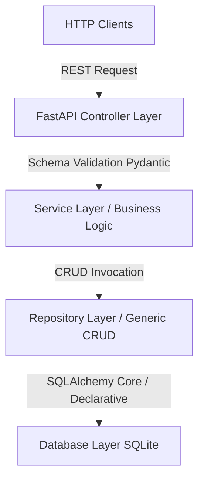

# Backend Architectural Specification

This document provides a technical overview of the backend foundation layer, detailing the execution pipeline, layering boundaries, and alignment with SOLID object-oriented design principles.

---

## 1. Clean Architecture & Layered Design

The backend uses a decoupled, layered design pattern to ensure that infrastructure concerns (database dialects, HTTP libraries, loggers) do not leak into the business logic.

### Layer Responsibilities

1. **Controller Layer (`app/controllers/`)**: Exposes REST interfaces, registers endpoints, validates incoming JSON payloads using Pydantic, and coordinates responses. It depends strictly on *Services* and *Repositories* injected via FastAPI dependencies.
2. **Service Layer (`app/services/`)**: Implements application-specific business logic (e.g., token calculations, contact notification dispatches, background tasks). It encapsulates complex algorithms away from the HTTP controller.
3. **Repository Layer (`app/repositories/`)**: Encapsulates all data access and SQL execution logic. Specific domain repositories subclass `GenericRepository` to gain standard CRUD queries.
4. **Model Layer (`app/models/`)**: Defines the relational database schemas using SQLAlchemy Declarative Mapping.
5. **Core Config & Utilities (`app/core/`, `app/utils/`)**: Provides foundational system support (JWT encryption, application configurations, central exceptions).

---

## 2. SOLID Design Principles

* **Single Responsibility Principle (SRP)**:
  - Database persistence logic is handled by specific repositories.
  - Security protocols are isolated inside `app/core/security.py`.
  - HTTP routing logic is isolated inside route files under `app/controllers/`.
* **Open/Closed Principle (OCP)**:
  - The repository layer exposes a base generic class `GenericRepository` which handles standard operations, allowing customization in sub-classes without modifying the base.
* **Liskov Substitution Principle (LSP)**:
  - Specific entity repositories can be substituted for the `GenericRepository` interface without breaking dependent components.
* **Interface Segregation Principle (ISP)**:
  - Service layers and repositories expose small, specialized methods instead of large, monolithic interfaces.
* **Dependency Inversion Principle (DIP)**:
  - Controllers depend on abstractions (e.g., `Session` injected from `get_db`) rather than concrete database instances.

---

## 3. Database Engine & Thread Model

SQLite is used for database operations. Because SQLite is serverless and executes within the same process thread space, the engine is configured to support concurrent FastAPI worker threads:
- **`check_same_thread=False`**: Prevents SQLite from raising thread-ownership exceptions when query connections span asynchronous worker tasks.
- **Foreign Keys Event Listener**: SQLite does not enforce foreign keys by default. On connection startup, the database engine executes `PRAGMA foreign_keys=ON` to enforce reference integrity.
